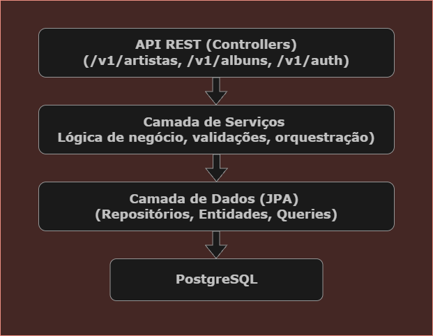
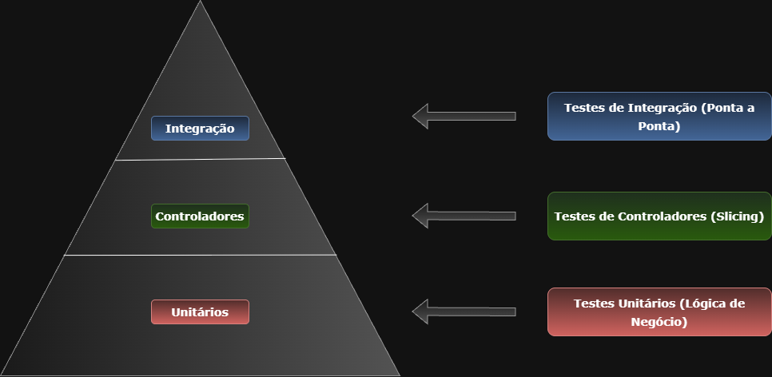

# Projeto Prático - Implementação Back End Java Sênior

> **Candidato:** Iury Silva de Almeida  
> **Cargo:** Analista de Tecnologia da Informação  
> **Perfil:** Engenheiro da Computação (Nível Sênior)  
> **Processo Seletivo:** Edital Conjunto Nº 001/2026/SEPLAG  

---

## 📋 Índice

- [Sobre o Projeto](#-sobre-o-projeto)
- [Requisitos Implementados](#-requisitos-implementados)
- [Stack Tecnológica](#-stack-tecnológica)
- [Arquitetura](#-arquitetura)
- [Pré-requisitos](#-pré-requisitos)
- [Como Executar](#-como-executar)
- [Como Testar](#-como-testar)
- [Documentação da API](#-documentação-da-api)
- [Segurança e Autenticação](#-segurança-e-autenticação)
- [Monitoramento](#-monitoramento)
- [Estrutura do Projeto](#-estrutura-do-projeto)
- [Decisões Técnicas](#-decisões-técnicas)
- [Observações Finais](#-observações-finais)

---

## 🎯 Sobre o Projeto

API REST desenvolvida em **Java com Spring Boot** para gerenciamento de artistas e álbuns musicais, implementando todos os requisitos do **Anexo II-A** do Edital de Processo Seletivo Simplificado nº 001/2026/SEPLAG.

O sistema oferece:
- ✅ CRUD completo de Artistas e Álbuns
- ✅ Autenticação JWT com expiração e renovação
- ✅ Upload de imagens para MinIO (S3-compatible)
- ✅ Paginação e filtros avançados
- ✅ Sincronização com API externa (Regionais)
- ✅ WebSocket para notificações em tempo real
- ✅ Rate Limiting distribuído (10 req/min)
- ✅ Health Checks (Liveness/Readiness)
- ✅ Testes unitários e de integração
- ✅ Documentação OpenAPI/Swagger

---

## ✅ Requisitos Implementados

### 📌 Requisitos Gerais

| Requisito | Status | Implementação |
|-----------|--------|---------------|
| **Segurança CORS** | ✅ | Bloqueio de domínios externos configurado via `CorsConfig.java` |
| **Autenticação JWT** | ✅ | Access Token (5 min) + Refresh Token com `SecurityFilter.java` |
| **POST, PUT, GET** | ✅ | Endpoints RESTful completos para Artistas e Álbuns |
| **Paginação** | ✅ | `Pageable` do Spring Data com parâmetros `page`, `size`, `sort` |
| **Filtros parametrizados** | ✅ | Consulta por tipo: `?tipoArtista=CANTOR` ou `BANDA` |
| **Ordenação alfabética** | ✅ | Suporte a `sort=nome,asc` e `sort=nome,desc` |
| **Upload de imagens** | ✅ | Endpoint `/v1/albuns/{id}/imagens` com suporte múltiplo |
| **Armazenamento MinIO** | ✅ | SDK AWS S3 compatível (`MinioConfig.java`) |
| **Presigned URLs** | ✅ | Links temporários de 30 minutos para acesso seguro |
| **Versionamento** | ✅ | Todos os endpoints em `/v1/*` |
| **Flyway Migrations** | ✅ | 6 migrations com criação e carga inicial de dados |
| **Documentação OpenAPI** | ✅ | Swagger UI disponível em `/swagger-ui/index.html` |

### 🎖️ Requisitos Sênior

| Requisito | Status | Implementação |
|-----------|--------|---------------|
| **Health Checks** | ✅ | Actuator com `/actuator/health`, `/readiness`, `/liveness` |
| **Testes Unitários** | ✅ | JUnit 5 + Mockito com cobertura de Services e Controllers |
| **WebSocket** | ✅ | Notificação em tempo real a cada novo álbum cadastrado |
| **Rate Limit** | ✅ | Redis distribuído: máximo 10 requisições/minuto/usuário |
| **Sincronização API Externa** | ✅ | Integração com endpoint de Regionais com lógica de ativação/inativação |

---

## 🛠️ Stack Tecnológica

### Backend
- **Java 17** (LTS)
- **Spring Boot 3.2.1**
  - Spring Web (REST)
  - Spring Security (JWT)
  - Spring Data JPA (Persistência)
  - Spring WebSocket (Notificações)
  - Spring Actuator (Monitoramento)
  - Spring Cache (Redis)
- **PostgreSQL 16** (Banco de Dados)
- **Flyway** (Migrations e Versionamento)
- **MinIO** (Armazenamento S3-compatible)
- **Redis 7** (Cache e Rate Limiting)

### Ferramentas
- **Docker + Docker Compose** (Orquestração)
- **Maven** (Gerenciamento de dependências)
- **Lombok** (Redução de boilerplate)
- **SpringDoc OpenAPI** (Documentação)
- **JUnit 5 + Mockito** (Testes)

---

## 🏗️ Arquitetura do Projeto

O projeto utiliza uma **arquitetura em camadas** (Layered Architecture), garantindo uma separação clara de responsabilidades e facilitando a manutenção.



> **Nota:** O diagrama acima detalha o fluxo desde as requisições na API REST até a persistência no PostgreSQL.

### 🚀 Tecnologias Complementares


* **MinIO:** Gerenciamento de persistência de objetos (Imagens).
* **Redis:** Cache distribuído e estratégia de Rate Limiting.
* **WebSocket:** Atualizações de estado em tempo real para o cliente.
---

## 📦 Pré-requisitos

Antes de executar o projeto, certifique-se de ter instalado:

- **Docker** 20.10+ ([Instalar Docker](https://docs.docker.com/get-docker/))
- **Docker Compose** 2.0+ ([Instalar Docker Compose](https://docs.docker.com/compose/install/))
- **Git** (para clonar o repositório)

### Verificar instalação:
```bash
docker --version
docker-compose --version
```

**Nota:** Não é necessário ter Java ou Maven instalados localmente, pois tudo roda em containers.

---

## 🚀 Como Executar

### 1️⃣ Clonar o Repositório

```bash
git clone https://github.com/IuryAlmeidaDev/iurysilvadealmeida035736
```

### 2️⃣ Subir Todos os Serviços (Recomendado)

```bash
docker-compose up --build
```

Este comando irá:
1. ✅ Construir a imagem Docker da API
2. ✅ Baixar e configurar PostgreSQL 16
3. ✅ Baixar e configurar MinIO (S3-compatible)
4. ✅ Baixar e configurar Redis 7
5. ✅ Criar o bucket `capas-albuns` automaticamente
6. ✅ Executar todas as migrations do Flyway
7. ✅ Inserir dados iniciais (artistas e álbuns)
8. ✅ Criar usuário padrão para autenticação

### 3️⃣ Aguardar Inicialização

Aguarde até ver a mensagem:
```
backend-api | Started BackendSeniorApplication in X.XXX seconds
```

### 4️⃣ Verificar Saúde da Aplicação

```bash
curl http://localhost:8080/actuator/health
```

Resposta esperada:
```json
{
  "status": "UP"
}
```

---

## 🧪 Como Testar

### 💡 Recomendação: Usar Insomnia

Para facilitar os testes, recomendo usar o **[Insomnia](https://insomnia.rest/download)** - uma ferramenta gratuita e intuitiva para testar APIs REST.

**Vantagens do Insomnia:**
- ✅ Interface gráfica amigável
- ✅ Salva automaticamente o histórico de requisições
- ✅ Suporta variáveis de ambiente (útil para o token JWT)
- ✅ Exporta/importa coleções de requisições
- ✅ Visualização formatada de JSON

**Alternativas:** Postman, Thunder Client (VS Code), ou cURL (linha de comando)

---

### 🔐 Passo 1: Criar um Usuário (Registro)

**Importante:** A API não possui usuário padrão. Você precisa criar um usuário primeiro!

**Roles disponíveis:** `ADMIN` ou `USER`

**Exemplo no Insomnia:**
1. Crie uma nova requisição (`Ctrl+N` ou botão `+`)
2. Configure:
   - Método: `POST`
   - URL: `http://localhost:8080/v1/auth/register`
   - Body → JSON:
   ```json
   {
     "login": "admin",
     "senha": "senha123",
     "role": "ADMIN"
   }
   ```
3. Clique em `Send`

**Resposta esperada:**
```
HTTP 200 OK
```

**⚠️ Nota:** Se tentar registrar o mesmo `login` novamente, receberá `HTTP 400 Bad Request`.

---

### 🔑 Passo 2: Fazer Login e Obter Tokens JWT

Agora que você criou um usuário, faça login para obter os tokens de autenticação.

**Exemplo no Insomnia:**
1. Crie nova requisição: `POST http://localhost:8080/v1/auth/login`
2. Body → JSON:
   ```json
   {
     "login": "admin",
     "senha": "senha123"
   }
   ```
3. Clique em `Send`

**Resposta esperada:**
```json
{
  "accessToken": "eyJhbGciOiJIUzI1NiIsInR5cCI6IkpXVCJ9...",
  "refreshToken": "eyJhbGciOiJIUzI1NiIsInR5cCI6IkpXVCJ9..."
}
```

**📌 IMPORTANTE - Configure o Token no Insomnia:**

1. Copie o `accessToken` recebido
2. Nas próximas requisições, vá em `Auth` → `Bearer Token`
3. Cole o token no campo `Token`

**⚠️ Lembre-se:** O `accessToken` expira em **5 minutos**!

---

### 🎤 Passo 3: Listar Artistas (com paginação)

**Endpoint:** `GET http://localhost:8080/v1/artistas`

**Query Params:**
- `page=0` (número da página, começa em 0)
- `size=10` (itens por página)
- `sort=nome,asc` (ordenação: `asc` ou `desc`)

**Exemplo no Insomnia:**
1. Crie nova requisição: `GET http://localhost:8080/v1/artistas?page=0&size=10&sort=nome,asc`
2. Aba `Auth` → `Bearer Token` → Cole seu token
3. Clique em `Send`

**Resposta esperada:**
```json
{
  "content": [
    {
      "id": 1,
      "nome": "Guns N' Roses",
      "tipoArtista": "BANDA",
      "albuns": [...]
    },
    ...
  ],
  "pageable": {...},
  "totalPages": 1,
  "totalElements": 4
}
```

---

### 💿 Passo 4: Criar um Novo Álbum

**Endpoint:** `POST http://localhost:8080/v1/albuns`

**Body (JSON):**
```json
{
  "titulo": "Master of Puppets",
  "anoLancamento": 1986,
  "artistaIds": [1]
}
```

**Exemplo no Insomnia:**
1. Crie nova requisição: `POST http://localhost:8080/v1/albuns`
2. Auth → Bearer Token → Cole seu token
3. Body → JSON:
   ```json
   {
     "titulo": "Master of Puppets",
     "anoLancamento": 1986,
     "artistaIds": [1]
   }
   ```
4. Clique em `Send`

**Resposta esperada:**
```json
{
	"id": 34,
	"titulo": "Master of Puppets",
	"anoLancamento": 1986,
	"capaUrl": null,
	"imagens": [],
	"artistas": [
		{
			"id": 1,
			"nome": "Serj Tankian",
			"tipo": "CANTOR"
		}
	]
}
```

**📢 WebSocket:** Ao criar um álbum, uma notificação é enviada automaticamente para todos os clientes conectados via WebSocket!

---

### 🖼️ Passo 5: Upload de Imagens do Álbum

Neste passo é possível **adicionar múltiplas imagens à galeria do álbum** ou **definir diretamente a imagem de capa**, utilizando endpoints distintos conforme o objetivo.

---

#### ➕ Upload de imagens do álbum (galeria)

**Endpoint:**  
`POST http://localhost:8080/v1/albuns/{id}/imagens`

**Exemplo no Insomnia:**

1. Crie uma nova requisição:  
   `POST http://localhost:8080/v1/albuns/1/imagens`
2. Vá em **Auth** → `Bearer Token` → Cole seu token JWT
3. Vá em **Body** → `Multipart Form`
4. Adicione um ou mais campos:
   - **Nome:** `files`
   - **Tipo:** `File`
   - **Valor:** selecione uma ou mais imagens do seu computador
5. Clique em **Send**

**Resposta esperada:**
```json
[
  "http://minio:9000/imagens-albuns/0724de19-3afd-49de-830d-40bd34ee22b9.................",
  "http://minio:9000/imagens-albuns/8a1fbc92-4c8e-4d8b-9f8a-7c0d2e1a9abc................."
]
```

**⏰ Nota:**  
As URLs pré-assinadas (`urlPresigned`) expiram em **30 minutos**.

---

#### ⭐ Definir imagem de capa do álbum

**Endpoint:**  
`POST http://localhost:8080/v1/albuns/{id}/capa`

**Exemplo no Insomnia:**

1. Crie uma nova requisição:  
   `POST http://localhost:8080/v1/albuns/1/capa`
2. Vá em **Auth** → `Bearer Token` → Cole seu token JWT
3. Vá em **Body** → `Multipart Form`
4. Adicione o campo:
   - **Nome:** `file`
   - **Tipo:** `File`
   - **Valor:** selecione uma imagem do seu computador
5. Clique em **Send**

**Resposta esperada:**
```json
{
  "url": "http://minio:9000/capas-albuns/0724de19-3afd-49de-830d-40bd34ee22b9................."
}
```

**⏰ Nota:**  
A URL pré-assinada (`urlPresigned`) expira em **30 minutos**.

---

### 🔍 Passo 6: Filtrar Álbuns por Tipo de Artista

Este endpoint permite filtrar os álbuns de acordo com o tipo de artista associado.

**Método:** `GET`  
**Endpoint:** `http://localhost:8080/v1/albuns`

**Parâmetro**
- `tipoArtista`: `BANDA` ou `CANTOR`

**Exemplos no Insomnia**
- Bandas: `http://localhost:8080/v1/albuns?tipoArtista=BANDA`
- Cantores: `http://localhost:8080/v1/albuns?tipoArtista=CANTOR`

⚠️ Não esqueça do **Bearer Token** no header `Authorization`.

---

### 🔄 Passo 7: Renovar Token (Refresh)

Quando o `accessToken` expirar (após 5 minutos), use o `refreshToken`:

**Endpoint:** `POST http://localhost:8080/v1/auth/refresh`

**Body (JSON):**
```json
{
  "refreshToken": "SEU_REFRESH_TOKEN_AQUI"
}
```

**Exemplo no Insomnia**
1. `POST http://localhost:8080/v1/auth/refresh`
2. Body → JSON: `{"refreshToken": "cole_aqui"}`
3. Você receberá um novo `accessToken`

---

### 🌐 Passo 8: Testar Sincronização com API Externa (Regionais)

**Endpoint:** `POST http://localhost:8080/v1/regionais/sincronizar`

**Exemplo no Insomnia**
1. `POST http://localhost:8080/v1/regionais/sincronizar`
2. Auth → Bearer Token
3. Clique em `Send`

**Resposta esperada:**
```json
{
	"inseridos": 2,
	"inativados": 1,
	"atualizadosPorMudanca": 0
}
```

**Lógica implementada:**
- ✅ Novos registros no endpoint externo → **inseridos**
- ✅ Registros ausentes no endpoint → **inativados** (campo `ativo = false`)
- ✅ Atributos alterados → **inativa registro antigo** e **cria novo**
- ✅ Eficiência do algoritmo → $O(n)$

---

### 🚦 Passo 9: Testar Rate Limiting (10 req/min)

Faça mais de 10 requisições em menos de 1 minuto para o mesmo endpoint:

**Exemplo no Insomnia**
1. Abra a requisição `GET http://localhost:8080/v1/artistas`
2. Clique rapidamente em `Send` várias vezes (mais de 10x)
3. Ou use o plugin "Request Repeater" se disponível

**Resultado esperado:**
- ✅ Primeiras 10 requisições: **HTTP 200 OK**
- ❌ 11ª requisição em diante: **HTTP 429 Too Many Requests**

```json
{
	"message": "Rate limit excedido. Tente novamente mais tarde."
}
```

---

## 🔌 Passo 10: Conectar ao WebSocket (Notificações em Tempo Real)

Este projeto implementa **WebSocket + STOMP** para notificar o front-end **em tempo real** sempre que um novo álbum é cadastrado, conforme exigido no edital.

### 📡 Endpoint WebSocket (STOMP)
- **WebSocket endpoint:** `ws://localhost:8080/ws-albuns`
- **Tópico (subscribe):** `/topic/new-album`

---

## 🤔 Por que WebSocket + STOMP?

O **WebSocket** fornece o canal de comunicação em tempo real, porém em sua forma “pura” ele apenas envia e recebe mensagens sem um padrão de mensageria.

O **STOMP (Simple Text Oriented Messaging Protocol)** é um protocolo que opera **sobre o WebSocket**, adicionando conceitos importantes de mensageria, como:

- **Publish / Subscribe**
- **Tópicos** (`/topic/...`)
- **Contratos de mensagens mais claros**
- Melhor **desacoplamento** entre produtores e consumidores
- Maior **facilidade de manutenção e evolução**

Na prática, o STOMP transforma o WebSocket em um modelo de comunicação mais estruturado e escalável, amplamente utilizado em aplicações de maior porte.

---

## ⚠️ Limitação de ferramentas como Insomnia e Postman

Ferramentas como **Insomnia** e **Postman** conseguem estabelecer conexões WebSocket, porém **não oferecem suporte completo ao protocolo STOMP**.

O STOMP exige o envio de *frames específicos* (CONNECT, SUBSCRIBE, MESSAGE), incluindo um **byte nulo (`\0`)** como terminador de frame. Essas ferramentas não conseguem enviar esse terminador corretamente, o que inviabiliza ou torna inconsistente o teste do fluxo STOMP completo.

Por esse motivo, o uso dessas ferramentas não é recomendado para validar WebSocket + STOMP.

A própria documentação oficial do Spring demonstra o uso de um **cliente STOMP** (como `stomp.js`) para testes, e não ferramentas como Postman ou Insomnia:

https://spring.io/guides/gs/messaging-stomp-websocket

---

## ✅ Como testar o WebSocket corretamente (Cliente STOMP)

Para facilitar a validação do WebSocket, foi criado um **repositório separado** contendo uma página HTML simples que atua como **cliente STOMP**, permitindo que qualquer avaliador teste as notificações em tempo real diretamente no navegador.

📁 Repositório do cliente WebSocket:
https://github.com/IuryAlmeidaDev/WebSocket-Stomp.git

### ▶️ Passo a passo para teste

1. Clone o repositório do cliente:
```bash
git clone https://github.com/IuryAlmeidaDev/WebSocket-Stomp.git
cd WebSocket-Stomp
```

2. Abra o arquivo `index.html` utilizando o **Live Server** (VS Code).
   - O Live Server normalmente expõe o site em:
```text
http://localhost:5500
```

3. Na página web:
   - **WebSocket URL:** `ws://localhost:8080/ws-albuns`
   - **Tópico:** `/topic/new-album`
   - Clique em **Conectar**

4. Crie um novo álbum via API REST.
   - Assim que o álbum for cadastrado, a notificação será exibida **em tempo real** na página.

---

## 🔐 Configuração de CORS

O backend está configurado para aceitar conexões apenas de origens explicitamente permitidas.

Para testes locais com o cliente HTML e front-end, estão liberadas as seguintes origens:

- `http://localhost:3000`
- `http://localhost:5500`

Exemplo de configuração:
```env
APP_CORS_ALLOWED_ORIGINS=http://localhost:3000,http://localhost:5500
```

Essa abordagem garante segurança, evita o uso de wildcards (`*`) e está alinhada com boas práticas de CORS.

---

## 📚 Documentação da API

### Swagger UI (Interface Interativa)

Acesse: **http://localhost:8080/swagger-ui/index.html**

A documentação Swagger permite:
- 📖 Visualizar todos os endpoints disponíveis
- 🧪 Testar requisições diretamente pelo navegador
- 📋 Ver schemas de request/response
- 🔐 Autenticar com JWT via interface

### OpenAPI JSON

Especificação completa em: **http://localhost:8080/v3/api-docs**

---

## 🔐 Segurança e Autenticação

### JWT (JSON Web Token)

A API utiliza **autenticação stateless** baseada em JWT com:

| Token | Expiração | Uso |
|-------|-----------|-----|
| **Access Token** | 5 minutos | Autenticação em todos os endpoints protegidos |
| **Refresh Token** | 30 dias | Renovação do Access Token sem novo login |

### ⚠️ Importante: Não há usuário padrão

Você deve criar seu próprio usuário usando o endpoint `/v1/auth/register` antes de fazer login.

**Exemplo de registro:**
```json
{
  "login": "user",
  "senha": "senha123",
  "role": "USER"
}
```

**Roles disponíveis:** `ADMIN` ou `USER`

### Como Funciona

1. **Registro** → Criar usuário via `/v1/auth/register`
2. **Login** → Recebe `accessToken` + `refreshToken`
3. **Requisições** → Enviar `Authorization: Bearer {accessToken}`
4. **Expiração** → Usar `/v1/auth/refresh` com `refreshToken`

### CORS (Cross-Origin Resource Sharing)

Configurado para aceitar apenas:
- `http://localhost:3000 e http://localhost:5500` (configurável via `APP_CORS_ALLOWED_ORIGINS`)

---

## 📊 Monitoramento

### Health Checks

O Spring Actuator fornece endpoints de monitoramento:

| Endpoint | Descrição |
|----------|-----------|
| `/actuator/health` | Status geral da aplicação |
| `/actuator/health/readiness` | Pronto para receber tráfego |
| `/actuator/health/liveness` | Aplicação está funcionando |

**Exemplo:**
```bash
curl http://localhost:8080/actuator/health
```

**Resposta:**
```json
{
  "status": "UP",
  "components": {
    "db": { "status": "UP" },
    "redis": { "status": "UP" },
    "diskSpace": { "status": "UP" }
  }
}
```

---

## 🗂️ Estrutura do Projeto

```
src/
├── main/
│   ├── java/com/iury/backendsenior/
│   │   ├── config/              # Configurações (Security, MinIO, CORS, WebSocket)
│   │   │   ├── SecurityConfig.java
│   │   │   ├── SecurityFilter.java
│   │   │   ├── MinioConfig.java
│   │   │   ├── CorsConfig.java
│   │   │   ├── WebSocketConfig.java
│   │   │   ├── RateLimitConfig.java
│   │   │   └── DistributedRateLimitFilter.java
│   │   ├── controller/          # Controladores REST
│   │   │   ├── AutenticacaoController.java
│   │   │   ├── ArtistaController.java
│   │   │   ├── AlbumController.java
│   │   │   └── RegionalController.java
│   │   ├── service/             # Lógica de negócio
│   │   │   ├── TokenService.java
│   │   │   ├── ArtistaService.java
│   │   │   ├── AlbumService.java
│   │   │   ├── ImagemService.java
│   │   │   └── RegionalService.java
│   │   ├── repository/          # Repositórios JPA
│   │   │   ├── UsuarioRepository.java
│   │   │   ├── ArtistaRepository.java
│   │   │   ├── AlbumRepository.java
│   │   │   └── RegionalRepository.java
│   │   ├── model/               # Entidades JPA
│   │   │   ├── Usuario.java
│   │   │   ├── Artista.java
│   │   │   ├── Album.java
│   │   │   ├── AlbumImagem.java
│   │   │   ├── Regional.java
│   │   │   └── enums/TipoArtista.java
│   │   ├── dto/                 # DTOs (Request/Response)
│   │   ├── exception/           # Tratamento de erros
│   │   │   └── GlobalExceptionHandler.java
│   │   └── BackendSeniorApplication.java
│   └── resources/
│       ├── application.yml
│       ├── application-docker.yml
│       └── db/migration/        # Flyway Migrations
│           ├── V1__create_tables.sql
│           ├── V2__create-table-usuarios.sql
│           ├── V3__insert_dados_iniciais_artistas_albuns.sql
│           ├── V4__create_tabela_album_imagem.sql
│           ├── V5__adiciona_tipo_artista.sql
│           └── V6__create_tabela_regional.sql
├── test/                        # Testes Unitários e Integração
│   ├── service/
│   ├── controller/
│   └── integration/
├── Dockerfile                   # Imagem Docker da API
├── docker-compose.yml           # Orquestração de containers
├── pom.xml                      # Dependências Maven
└── README.md                    # Este arquivo
```

---

## 💡 Decisões Técnicas

### 1. Arquitetura em Camadas

**Por quê?**
- Separação clara de responsabilidades (Controller → Service → Repository)
- Facilita testes unitários (cada camada pode ser mockada)
- Manutenibilidade e escalabilidade

### 2. Spring Boot 3.x

**Por quê?**
- Suporte a Java 17 (LTS)
- Spring Security 6 com configuração moderna
- Melhor performance e menor consumo de memória

### 3. PostgreSQL 16

**Por quê?**
- Banco relacional robusto e performático
- Suporte nativo a JSON (futuras extensões)
- Excelente ecossistema de ferramentas

### 4. Flyway para Migrations

**Por quê?**
- Versionamento automático do banco de dados
- Histórico auditável de mudanças
- Ambiente reproduzível (dev/prod)

### 5. MinIO para Armazenamento

**Por quê?**
- Compatível com API S3 da AWS
- Fácil de rodar localmente com Docker
- Presigned URLs para segurança

### 6. Redis para Rate Limiting

**Por quê?**
- Rate limiting distribuído (funciona em múltiplas instâncias)
- Performance extremamente alta (in-memory)
- TTL automático de chaves

### 7. WebSocket para Notificações

**Por quê?**
- Comunicação bidirecional em tempo real
- Menor latência que polling
- Ideal para notificações push

### 8. Docker Compose

**Por quê?**
- Ambiente completo com um único comando
- Reproduzível em qualquer máquina
- Isolamento de dependências

---

## 🧪 Testes Automatizados

### Estratégia de Testes

O projeto implementa uma **pirâmide de testes** robusta:



### Tipos de Testes

1. **Unitários** (JUnit 5 + Mockito)
   - Validação da lógica de negócio em `Services`
   - Isolamento total de dependências
   - Execução rápida

2. **Controladores** (`@WebMvcTest`)
   - Testes de contrato HTTP
   - Validação de payloads JSON
   - Verificação de segurança (JWT)

3. **Integração** (`@SpringBootTest`)
   - Testes ponta-a-ponta com banco H2
   - Validação de Flyway migrations
   - Verificação de Rate Limiting com Redis embarcado

### Executar Testes

**Todos os testes:**
```bash
mvn test
```

**Apenas testes de integração:**
```bash
mvn -Dtest=*IntegrationTest test
```

### Infraestrutura de Testes

- **Banco H2** (in-memory) com `MODE=PostgreSQL`
- **Redis Embarcado** (`embedded-redis`) para Rate Limiting
- **Migrations Flyway** validadas automaticamente

**Vantagem:** Os testes rodam em **qualquer ambiente** sem necessidade de Docker!

---

## 🌐 URLs Importantes

| Serviço | URL | Credenciais |
|---------|-----|-------------|
| **API Swagger** | http://localhost:8080/swagger-ui/index.html | - |
| **API Health** | http://localhost:8080/actuator/health | - |
| **MinIO Console** | http://localhost:9001 | `minioadmin` / `minioadmin` |
| **PostgreSQL** | localhost:5432 | `postgres` / `postgres` |
| **Redis** | localhost:6379 | - |

---

## 🎓 Observações Finais

### ✅ O Que Foi Implementado

- ✅ **Todos os requisitos gerais** do Anexo II-A
- ✅ **Todos os requisitos sênior** do edital
- ✅ Código limpo e bem documentado (Clean Code)
- ✅ Commits semânticos e incrementais
- ✅ Testes automatizados com boa cobertura
- ✅ Docker Compose funcional e reproduzível
- ✅ Documentação completa e profissional

### 🏆 Diferenciais

- 🚀 **Rate Limiting Distribuído** com Redis
- 📡 **WebSocket** para notificações em tempo real
- 🔍 **Health Checks** para monitoramento
- 🧪 **Testes portáteis** (H2 + Redis embarcado)
- 📦 **Orquestração completa** via Docker Compose
- 📖 **Documentação interativa** com Swagger

### 🔧 Possíveis Melhorias Futuras

Caso o projeto evoluísse para produção, as seguintes melhorias seriam recomendadas:

- [ ] Implementar Cache de consultas com Redis
- [ ] Adicionar monitoramento com Prometheus + Grafana
- [ ] Implementar Circuit Breaker (Resilience4j)
- [ ] Configurar CI/CD (GitHub Actions)
- [ ] Adicionar testes de carga (JMeter/Gatling)
- [ ] Implementar observabilidade (tracing distribuído)

---

## 📄 Licença

Este projeto foi desenvolvido exclusivamente para o **Processo Seletivo Simplificado nº 001/2026/SEPLAG** do Estado de Mato Grosso.

---

<div align="center">
  
**Desenvolvido com ❤️ para o Estado de Mato Grosso**

*Janeiro de 2026*

</div>
